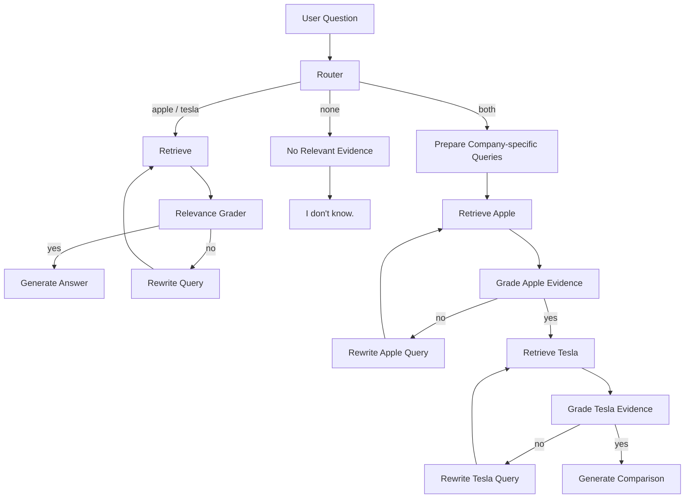

# Multi-Doc Financial Analyst — LangGraph RAG

A state-aware, multi-document financial QA system for Apple and Tesla financial filings.

The project uses **LangGraph** to control retrieval, routing, and self-correction instead of relying on a single linear RAG chain. It can route a question to the appropriate company document, judge retrieval quality, rewrite weak queries, and generate answers only from retrieved evidence.

## Highlights

- **Multi-document routing**: classifies questions into `apple`, `tesla`, `both`, or `none`
- **Separate Chroma vector stores** for Apple and Tesla documents
- **Relevance grading** before answer generation
- **Query rewriting** when retrieved evidence is insufficient
- **Dedicated comparison workflow** for Apple-vs-Tesla questions
- **Grounded generation**: answers only from retrieved context
- **Safe fallback**: returns `I don't know.` when evidence is missing
- Includes a **LangChain ReAct baseline** for comparison with the LangGraph workflow
- Supports multiple LLM providers through environment configuration

## Architecture



## How It Works

### 1. Build the retrieval layer

`build_rag.py` performs the document ingestion pipeline:

```text
PDF
 -> text extraction
 -> text cleaning
 -> chunking
 -> embedding
 -> Chroma vector store
```

The current configuration uses:

- Apple: `FY24_Q4_Consolidated_Financial_Statements.pdf`
- Tesla: `tsla-20241231-gen.pdf`
- Vector database: **Chroma**
- Default embedding model:
  `sentence-transformers/paraphrase-multilingual-MiniLM-L12-v2`

The project also supports switching to:

`sentence-transformers/all-MiniLM-L6-v2`

### 2. Route each question

The LangGraph router classifies a question into one of four targets:

```text
apple
tesla
both
none
```

This keeps unrelated documents out of retrieval and gives comparison questions their own workflow.

### 3. Grade retrieved evidence

After retrieval, an LLM-based binary grader decides whether the retrieved context is sufficient:

```text
yes -> generate
no  -> rewrite and retrieve again
```

The grader is deliberately strict: empty, unrelated, vague, or insufficient context is rejected.

### 4. Rewrite weak queries

If retrieval is not good enough, the system rewrites the query using more retrieval-friendly financial terminology.

Example:

```text
Original:
How much did Apple spend on new tech in 2024?

Rewritten:
What were Apple's research and development expenses in 2024?
```

The rewrite preserves the original company and year instead of inventing new facts.

### 5. Handle comparison questions separately

For questions involving both Apple and Tesla, the graph creates separate company-specific queries and retrieves evidence from each vector store independently.

A comparison answer is generated only if **both sides** have sufficient retrieved evidence. Otherwise, the system returns:

```text
I don't know.
```

This avoids comparing one retrieved value with unsupported model memory.

## LangGraph State

The graph stores workflow information in `AgentState`, including:

- original question
- route target
- retrieved documents
- rewrite / search count
- Apple-side query, evidence, grade, and retry count
- Tesla-side query, evidence, grade, and retry count
- final generation

This explicit state is one of the main reasons LangGraph is more suitable than a simple linear chain for this workflow.

## LangGraph vs. LangChain ReAct

The repository also contains a legacy ReAct agent implemented with LangChain.

### LangChain ReAct baseline

The ReAct agent lets the LLM repeatedly choose tools using:

```text
Thought
Action
Action Input
Observation
...
Final Answer
```

This approach is flexible, but much of the control flow is decided dynamically by the LLM.

### LangGraph workflow

LangGraph makes the control flow explicit:

- route
- retrieve
- grade
- rewrite
- retry
- generate

For this project, LangGraph provides clearer state management and more predictable handling of failure cases such as insufficient retrieval or multi-company comparisons.

## Project Structure

```text
.
├── data/
│   ├── FY24_Q4_Consolidated_Financial_Statements.pdf
│   └── tsla-20241231-gen.pdf
├── build_rag.py
├── config.py
├── langgraph_agent.py
├── .env.example
└── README.md
```

`report.pdf` can also be kept in the repository if you want to preserve the original course submission and experiment discussion.

## Setup

### 1. Create and activate a virtual environment

Windows:

```bash
python -m venv .venv
.venv\Scripts\activate
```

macOS / Linux:

```bash
python -m venv .venv
source .venv/bin/activate
```

### 2. Configure the LLM provider

Copy `.env.example` to `.env` and fill in the API key for the provider you want to use.

Example with OpenAI:

```env
LLM_PROVIDER=openai
OPENAI_API_KEY=your_openai_api_key
OPENAI_MODEL=gpt-4o-mini
```

`config.py` also supports Google Gemini and Anthropic.

### 3. Build the vector databases

Place the Apple and Tesla PDFs in `data/`, then run:

```bash
python build_rag.py
```

The generated Chroma databases are stored under:

```text
chroma_db/
```

### 4. Run the LangGraph agent

```python
from langgraph_agent import run_graph_agent

print(run_graph_agent("What was Apple's revenue in 2024?"))
print(run_graph_agent("How much did Apple spend on new tech in 2024?"))
print(run_graph_agent("Compare Apple and Tesla revenue in 2024."))
print(run_graph_agent("What is NVIDIA's revenue in 2024?"))
```

### 5. Run the LangChain ReAct baseline

```python
from langgraph_agent import run_legacy_agent

print(run_legacy_agent("What was Apple's revenue in 2024?"))
```

## Retrieval Experiments

The project also evaluates retrieval design choices rather than treating the vector database configuration as fixed.

### Embedding models

Two embedding models were compared:

```text
sentence-transformers/paraphrase-multilingual-MiniLM-L12-v2
sentence-transformers/all-MiniLM-L6-v2
```

In the tested Apple/Tesla financial-document workload, the two models produced **similar retrieval and answer quality**. A likely reason is that the corpus is small and highly focused, so both models already provide sufficient semantic representation for the tested questions.

The multilingual model did not show a strong advantage here because the source documents and required answers are primarily in English.

### Chunk size

Three chunk sizes were tested:

```text
1000
2000
4000
```

The experiment focused on the trade-off between:

- **Context Precision** — smaller chunks are more focused and may reduce unrelated text
- **Context Completeness** — larger chunks preserve more surrounding structure, which is useful for large financial tables

Observed interpretation:

- `1000`: more focused retrieval, but greater risk of separating table labels, years, and values
- `2000`: a balanced setting for the tested workload
- `4000`: better table-context preservation, but with more irrelevant content inside each chunk

Across the tested questions, overall answer differences were not dramatic. This suggests that, for a small and focused corpus, the **workflow design**—routing, grading, rewriting, and comparison handling—can matter more than changing the embedding model alone.

> Note: the current `build_rag.py` uses `chunk_size=1000`. The values above describe the configurations tested in the assignment report, not a claim that the repository is currently configured to 2000.

To change either the embedding model or chunk size, rebuild `chroma_db/` so the stored vectors match the new configuration.

## Tested Question Types

The assignment report verifies the workflow on four representative cases:

1. **Single-company factual query** — Apple revenue in 2024
2. **Vague financial query requiring rewrite** — “new tech spending” rewritten toward R&D expenses
3. **Cross-company comparison** — Apple vs. Tesla revenue
4. **Out-of-scope query** — NVIDIA revenue, which safely falls back to `I don't know.`

These cases exercise the router, grader, rewriter, comparison branch, and grounded fallback behavior.

## Reliability Guardrails

The generator is intentionally constrained:

- answers must use only retrieved context
- years such as 2024, 2023, and 2022 must be distinguished carefully
- unsupported values must not be guessed
- source tags are required in generated answers
- missing evidence falls back to `I don't know.`

The implementation also includes retry handling for provider/API failures.

## Tech Stack

- Python
- LangGraph
- LangChain
- Chroma
- Hugging Face Sentence Transformers
- PyMuPDF
- OpenAI / Google Gemini / Anthropic-compatible LangChain chat models

## What I Implemented

This project started from TA-provided assignment scaffolding. The provided baseline already included the general LangGraph node structure (`retrieve`, `grade`, `rewrite`, `generate`), a ReAct baseline, vector-store initialization, and a simple router that could retrieve Apple, Tesla, or both documents.

My work focused on completing/refining the assignment requirements and extending the baseline where the original workflow was not strict enough for comparison questions.

Key contributions:

- refining the router, grader, rewriter, and generator behavior for the assignment requirements
- strengthening grounded generation and `I don't know.` fallbacks when evidence is insufficient
- independently designing and implementing a **dedicated Apple/Tesla dual-branch comparison workflow**
- adding separate Apple-side and Tesla-side retrieval, grading, rewriting, retry state, and comparison generation
- preventing comparison answers when evidence for either company is missing
- testing two embedding models and three chunk-size configurations
- analyzing retrieval trade-offs and documenting the system design

## Scope

This is a course project intended to demonstrate:

- stateful RAG workflows
- multi-document retrieval
- agent routing
- retrieval self-correction
- grounded answer generation
- differences between LangChain ReAct and LangGraph orchestration
